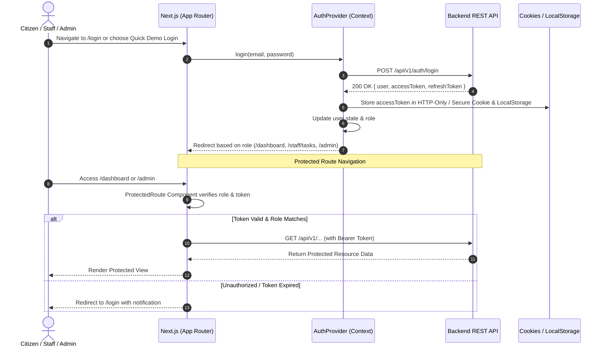
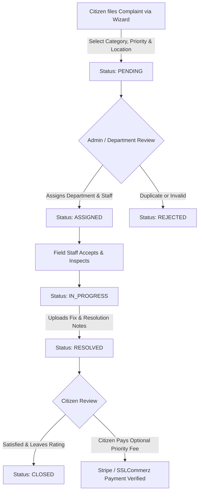

# 🏛️ CityCare Pro — Municipal Grievance & Smart Citizen Service Portal (Frontend)

A next-generation municipal grievance redressal and public service management web platform built with **Next.js 16 (App Router)**, **React 19**, **TypeScript**, and **Tailwind CSS v4**. It bridges the gap between citizens, field staff, and municipal administration with real-time complaint tracking, automated SLA management, interactive dashboards, and secure role-based access control.

[](https://nextjs.org/)
[](https://react.dev/)
[](https://www.typescriptlang.org/)
[](https://tailwindcss.com/)
[](https://tanstack.com/query)
[](https://zod.dev/)
[](https://recharts.org/)
[](https://lucide.dev/)
[](https://opensource.org/licenses/MIT)

---

## 🚀 Live Demo & Deployments

- 🌐 **Live Web Application**: [https://citycare-pro.vercel.app](https://citycare-pro.vercel.app)
- 🔌 **Backend API Base**: `http://localhost:5000/api/v1` 

---

## 🛠️ Technology Stack & Architecture

- **Framework**: **Next.js 16.3 (App Router)** leveraging Server & Client Components, Route Handlers, and Optimized Metadata.
- **UI Library & Runtime**: **React 19** with modern hooks, Suspense boundaries, and smooth transitions.
- **Language**: **TypeScript 5** ensuring strict compile-time type safety across API contracts and UI states.
- **Styling & Design System**: **Tailwind CSS v4** with PostCSS integration, `@tailwindcss/postcss`, custom HSL palette, and fluid responsive design.
- **Data Fetching & State**: **@tanstack/react-query (v5)** for query caching, background refetching, and optimistic updates.
- **Form Management**: **React Hook Form** with **@hookform/resolvers** and **Zod** schema validations.
- **Data Visualization**: **Recharts** for municipal performance trends, resolution analytics, and category breakdown charts.
- **Notifications & Delights**: **Sonner** toast system for real-time feedback, and **canvas-confetti** for milestone celebrations.
- **Icons**: **Lucide React** for modern, crisp vector iconography.
- **Authentication**: JWT Cookie + LocalStorage synchronization via custom `AuthContext` and route protection wrappers.

---

## 👥 Role-Based Access Control (RBAC) Matrix

CityCare Pro features an enterprise-grade multi-role permission model:

| Feature / Capability | Public / Visitor | Citizen | Field Staff | Municipal Admin |
| :--- | :---: | :---: | :---: | :---: |
| **Browse Landing Page & Public Stats** | ✔️ | ✔️ | ✔️ | ✔️ |
| **Search & View Public Complaints Directory** | ✔️ | ✔️ | ✔️ | ✔️ |
| **View City Analytics & Resolution Charts** | ✔️ | ✔️ | ✔️ | ✔️ |
| **Submit Public Contact Inquiry** | ✔️ | ✔️ | ✔️ | ✔️ |
| **Read Approved Community Feedback** | ✔️ | ✔️ | ✔️ | ✔️ |
| **Account Registration & Login** | ✔️ | ✔️ | ✔️ | ✔️ |
| **File Complaint (Multi-Step Wizard)** | ❌ | ✔️ | ❌ | ✔️ |
| **Citizen Dashboard & My Complaints** | ❌ | ✔️ | ❌ | ✔️ |
| **Track Complaint Timeline & Status** | ❌ | ✔️ | ✔️ | ✔️ |
| **Submit Complaint Rating & Feedback** | ❌ | ✔️ | ❌ | ❌ |
| **Pay Premium Service Fee (Stripe)** | ❌ | ✔️ | ❌ | ❌ |
| **View Assigned Tasks Board** | ❌ | ❌ | ✔️ | ✔️ |
| **Update Complaint Status & Work Proof** | ❌ | ❌ | ✔️ | ✔️ |
| **Staff SLA Monitoring & Deadlines** | ❌ | ❌ | ✔️ | ✔️ |
| **Executive Admin Overview & KPI Cards** | ❌ | ❌ | ❌ | ✔️ |
| **Assign Department & Staff to Complaints** | ❌ | ❌ | ❌ | ✔️ |
| **Manage Municipal Departments (CRUD)** | ❌ | ❌ | ❌ | ✔️ |
| **User & Staff Role Management** | ❌ | ❌ | ❌ | ✔️ |
| **Moderate Public Feedback (Approve/Reject)** | ❌ | ❌ | ❌ | ✔️ |
| **Manage Contact Inquiries & Quick Reply** | ❌ | ❌ | ❌ | ✔️ |
| **Audit Logs & Activity Trail** | ❌ | ❌ | ❌ | ✔️ |
| **Archived & Soft-Deleted Complaints Management**| ❌ | ❌ | ❌ | ✔️ |

---

## 🔐 Authentication & Protected Routing Flow

The frontend handles session authentication seamlessly through an integrated JWT + Cookie + State system:



---

## 🔄 Complaint Redressal Lifecycle Workflow



---

## 🌟 Application Features & Page Modules

### 1. 🌐 Public Portal
- **Landing Page (`/`)**: Hero banner with live incident tracker ticker, quick stats cards, featured issue categories, step-by-step workflow guide, latest community feedback carousel, and interactive city metrics.
- **Complaints Explorer (`/complaints`)**: Filter complaints by category, priority, status, and keyword search with real-time responsive grid cards.
- **Complaint Detail View (`/complaints/[id]`)**: Full complaint metadata, location coordinates, visual attachments, interactive chronological timeline tracker, staff resolver card, and resolution notes.
- **Services Directory (`/services`)**: Comprehensive municipal services breakdown (Roads, Waste Management, Electricity, Water Supply, Public Health, Street Lighting).
- **Public City Analytics (`/analytics`)**: Open civic dashboard with Recharts visualizations, monthly complaint velocity, resolution percentages, and SLA compliance metrics.
- **Community Feedback (`/feedback`)**: Citizen testimonials wall with star rating filter and dynamic submission form with moderation pipeline.
- **About Us (`/about`) & Contact (`/contact`)**: Municipal mission statement, emergency contacts directory, and interactive citizen message submission form.
- **Pricing & Priority Services (`/pricing`)**: Overview of standard civic resolution vs. fast-track priority municipal services.

### 2. 👤 Citizen Portal
- **Citizen Dashboard (`/dashboard`)**: Personal grievance command center with status breakdowns (Pending, In-Progress, Resolved), recent submissions, and quick-action shortcuts.
- **File a Complaint (`/complaints/new`)**: Multi-step interactive wizard form with category selection, priority indicators, image attachments, geolocation, and instant preview.
- **My Complaints (`/dashboard/my-complaints`)**: Filterable personal list with instant tracking badges, timeline views, and direct feedback submission modal.
- **Payments Center (`/dashboard/payments`)**: Detailed history of all service payments, transaction receipts, invoice download shortcuts, and payment statuses.
- **Profile Settings (`/dashboard/profile`)**: Account details, phone number update, avatar management, and security credentials.

### 3. 👷 Staff Portal
- **Staff Task Board (`/staff/tasks`)**: Streamlined operational hub for assigned field staff with urgent task flags, status toggling (`IN_PROGRESS`, `RESOLVED`, `CLOSED`), and work proof documentation modal.
- **SLA & Performance Tracker (`/staff/sla`)**: Real-time SLA countdown counters, overtime risk flags, on-time resolution rates, and completed task quotas.

### 4. 🛡️ Municipal Admin Control Center
- **Executive Overview (`/admin`)**: Real-time KPI statistics (Total Grievances, Resolution Ratio, Avg Resolution Time, Active Staff, At-Risk SLA counts), and Recharts category distribution graphs.
- **Complaint Management (`/admin/manage`)**: Advanced search, filtering by department, soft-deletion, and modal for assigning departments and field technicians.
- **Department Management (`/admin/departments`)**: Create, edit, and organize municipal departments with unique department codes.
- **User & Staff Directory (`/admin/users`)**: Search, paginate, and switch roles between `CITIZEN`, `STAFF`, and `ADMIN`.
- **Feedback Moderation (`/admin/feedback`)**: Review public citizen ratings and comments with one-click **Approve**, **Reject**, or **Feature** actions.
- **Citizen Inquiries Inbox (`/admin/contact`)**: Message triage center with status markers (`UNCHECKED`, `CHECKED_BY_ME`, `CHECKED_BY_OTHER`), and modal for in-app direct email replies.
- **Audit Logs (`/admin/audit`)**: Immutable log table capturing user actions, IP addresses, target resource modifications, and timestamps for accountability.
- **Archived Complaints (`/admin/archived`)**: View soft-deleted complaints with full restore capabilities and deletion audit trails.

---

## 📁 Project Architecture & Directory Layout

```
fontend/
├── public/                       # Static public assets, icons, and SVG illustrations
├── src/
│   ├── app/                      # Next.js App Router routes and pages
│   │   ├── about/                # About Municipal Portal page
│   │   ├── admin/                # Admin Control Center routes
│   │   │   ├── archived/         # Soft-deleted / archived complaints & restore
│   │   │   ├── audit/            # Compliance & user activity audit logs
│   │   │   ├── contact/          # Citizen inquiries inbox & reply modal
│   │   │   ├── departments/      # Municipal department management (CRUD)
│   │   │   ├── feedback/         # Public feedback moderation pipeline
│   │   │   ├── manage/           # Complaints assignment & status oversight
│   │   │   ├── users/            # User directory & role assignment
│   │   │   ├── layout.tsx        # Admin route wrapper & navigation guard
│   │   │   └── page.tsx          # Admin Executive Analytics Dashboard
│   │   ├── analytics/            # Public city grievance analytics & trends
│   │   ├── complaints/           # Complaints exploration & creation
│   │   │   ├── [id]/             # Dynamic complaint detail & tracking view
│   │   │   ├── new/              # Multi-step complaint submission wizard
│   │   │   └── page.tsx          # Public complaints search & filter directory
│   │   ├── contact/              # Citizen contact & inquiry submission
│   │   ├── dashboard/            # Citizen Personal Portal
│   │   │   ├── my-complaints/    # Citizen complaint management & feedback
│   │   │   ├── payments/         # Payment history & transaction receipts
│   │   │   ├── profile/          # User profile & credentials management
│   │   │   ├── layout.tsx        # Dashboard authenticated layout
│   │   │   └── page.tsx          # Citizen overview & KPI cards
│   │   ├── feedback/             # Community feedback wall & submission
│   │   ├── login/                # Authentication page (Credentials + Demo + Google)
│   │   ├── payment/              # Payment handling pages
│   │   │   ├── cancel/           # Stripe canceled payment redirect
│   │   │   ├── init/             # Payment initialization handler
│   │   │   └── success/          # Payment success & confetti confirmation
│   │   ├── pricing/              # Standard vs Priority civic services
│   │   ├── register/             # Citizen & staff registration form
│   │   ├── services/             # Municipal services catalogue
│   │   ├── staff/                # Field Staff Portal
│   │   │   ├── sla/              # SLA performance monitoring & deadlines
│   │   │   ├── tasks/            # Assigned complaints & status updates
│   │   │   └── layout.tsx        # Staff authenticated navigation guard
│   │   ├── error.tsx             # Global error boundary component
│   │   ├── favicon.ico           # Application favicon
│   │   ├── globals.css           # Tailwind CSS v4 directives & root theme
│   │   ├── layout.tsx            # Root HTML layout with Navbar & Footer
│   │   ├── loading.tsx           # Global loading spinner / skeleton fallback
│   │   ├── not-found.tsx         # Custom 404 Not Found page
│   │   └── page.tsx              # CityCare Pro Landing Page
│   │
│   ├── components/               # Modular UI and domain-specific components
│   │   ├── auth/
│   │   │   └── ProtectedRoute.tsx # Route protection & RBAC authorization guard
│   │   ├── charts/
│   │   │   ├── CategoryChart.tsx  # Recharts Category breakdown chart
│   │   │   └── TrendChart.tsx     # Recharts Monthly performance trend chart
│   │   ├── complaints/
│   │   │   ├── AssignStaffModal.tsx # Admin modal for staff/department assignment
│   │   │   ├── ComplaintCard.tsx    # Responsive complaint item card
│   │   │   ├── ComplaintFilterBar.tsx # Multi-attribute search & filter toolbar
│   │   │   ├── FeedbackModal.tsx    # Star rating & review submission modal
│   │   │   └── UpdateStatusModal.tsx# Staff modal for work status updates
│   │   ├── forms/
│   │   │   └── ComplaintWizardForm.tsx # 4-step reactive complaint creation form
│   │   ├── layout/
│   │   │   ├── Navbar.tsx        # Responsive navigation bar with role switcher
│   │   │   └── Footer.tsx        # Enterprise municipal footer with links
│   │   └── ui/
│   │       ├── EmptyState.tsx    # Reusable zero-data illustration & message
│   │       ├── PriorityBadge.tsx # Priority pill badge (Low, Medium, High, Urgent)
│   │       ├── SkeletonLoader.tsx# Shimmer loading placeholders
│   │       ├── StatCard.tsx      # Interactive statistic indicator card
│   │       ├── StatusBadge.tsx   # Status pill badge (Pending, Resolved, etc.)
│   │       └── TimelineView.tsx  # Chronological milestone step timeline
│   │
│   ├── lib/                      # Core utilities, API client & providers
│   │   ├── api.ts                # Centralized Type-safe ApiClient with all endpoints
│   │   ├── auth-context.tsx      # AuthProvider, session state & demo login
│   │   ├── providers.tsx         # TanStack Query & Sonner Toaster wrapper
│   │   └── utils.ts              # Class name merging, date & currency formatters
│   │
│   └── types/
│       └── index.ts              # TypeScript interfaces, types, and API contracts
│
├── .env.local                    # Local environment variables configuration
├── eslint.config.mjs             # ESLint configuration
├── next.config.ts                # Next.js runtime configuration
├── package.json                  # Dependencies, scripts, and package metadata
├── postcss.config.mjs            # PostCSS configuration for Tailwind CSS v4
├── tsconfig.json                 # TypeScript compiler configuration
└── README.md                     # Comprehensive Project Documentation
```

---

## ⚙️ Environment Variables Configuration

Create a `.env.local` file in the root directory:

```env
# Backend REST API URL (Server-side routes)
NEXT_BASE_API_URL=http://localhost:5000/api/v1

# Public API Base URL (Client-side assets & uploads)
NEXT_PUBLIC_API_URL=http://localhost:5000

# Optional: Deployment Domain URL
NEXT_PUBLIC_SITE_URL=http://localhost:3000
```

---

## 🔧 Installation & Execution Instructions

### 1. Prerequisites

- **Node.js**: `v20.x` or higher (`node -v`)
- **Package Manager**: `npm` (v10+), `pnpm`, or `yarn`
- **Backend API**: Running CityCare Backend on `http://localhost:5000` (or configured URL)

### 2. Clone Repository & Setup

```bash
# Clone the repository
git clone https://github.com/Fahim-rafi24/B7A7_LEVEL2.git
cd B7A7_LEVEL2/fontend

# Create environment configuration
cp .env.local.example .env.local
```

### 3. Install Dependencies

```bash
npm install
```

### 4. Development Server Run

```bash
npm run dev
```

Open [http://localhost:3000](http://localhost:3000) in your browser to view the application.

### 5. Production Build & Optimization

```bash
# Create optimized production build
npm run build

# Start production server
npm run start
```

---

## 🧪 Demo Accounts & Credentials

The application provides a **1-Click Quick Demo Login Switcher** directly on the `/login` page:

| Role | Demo Email | Password | Default Redirect |
| :--- | :--- | :--- | :--- |
| **Municipal Admin** | `admin@citycare.com` | `admin123456` | `/admin` |
| **Field Staff** | `staff@citycare.com` | `staff123456` | `/staff/tasks` |
| **Citizen** | `citizen@citycare.com` | `citizen123456` | `/dashboard` |

> 💡 **Tip**: On the Login page, simply click any of the **Demo Account Pills** (*Admin*, *Staff*, or *Citizen*) to automatically authenticate with full role permissions without typing.

---

## 🌟 Key Highlights & Design Innovations

- **Modern Glassmorphic & Clean Aesthetic**: Tailored civic color system with smooth gradients, border highlights, and interactive micro-interactions.
- **Smart Multi-Step Complaint Wizard**: Progressive form validation with category pickers, urgency selectors, image preview, and summary review.
- **Interactive Chronological Timelines**: Transparent issue lifecycle tracking with visual checkmarks and resolver notes.
- **Data-Driven Civic Analytics**: Interactive charts built with Recharts displaying resolution velocity, department loads, and monthly grievance volumes.
- **Strict Client-Side Validation**: Zod-powered schema validation preventing erroneous or incomplete form submissions.
- **Resilient Fallbacks & Skeletons**: Smooth loading states, error boundaries, empty states, and toast feedback for seamless user experience.
- **Full Mobile Responsiveness**: Fluid layouts optimized across smartphones, tablets, laptops, and ultra-wide displays.

---

_Built with ❤️ for Modern Civic Engagement and Smart Municipal Governance._
